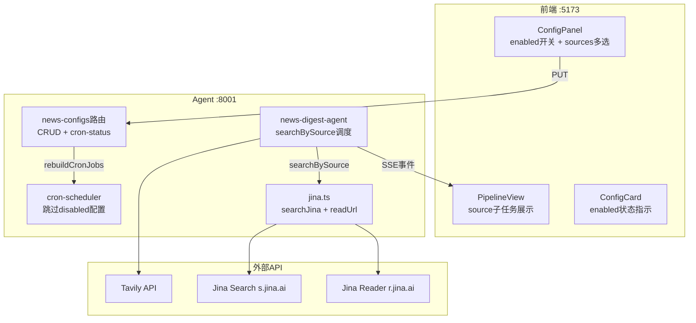

# 开发计划：新闻汇集多新闻源集成

## 故事优先级

| 优先级 | 故事 | 原因 |
|--------|------|------|
| P0 | US-1 数据模型 | 所有故事的前置依赖 |
| P0 | US-2 Jina API | 新源的基础设施 |
| P0 | US-3 并行搜索工作流 | 核心功能 |
| P1 | US-4 cron 识别 enabled | 依赖 US-1 |
| P1 | US-5 环境变量 | 一次性配置 |
| P1 | US-6 前端表单 | 交互入口 |
| P1 | US-7 前端卡片 | 配合 US-6 |
| P1 | US-8 API Key 状态 | 配合 US-6 |
| P1 | US-10 流水线 UI | 配合 US-3 |
| P2 | US-9 清数据+测试 | 最后验收 |

## 开发顺序 & 依赖

```
US-1 ──→ US-2 ──→ US-3 ──→ US-10
  │                          │
  └──→ US-4 ──→ US-5 ──→ US-8
                    │
                    └──→ US-6 ──→ US-7 ──→ US-9
```

## 技术方案

### 架构图



### 关键设计决策

1. **搜索源抽象**：不引入工厂模式。`searchBySource()` 作为 switch-case 调度器，简单直接，3 个源无需过度设计
2. **并行策略**：`Promise.allSettled` 而非 `Promise.all`，单源失败不阻塞其他。`jina_deep` 的 `readUrl` 用 `p-limit` 包装
3. **类型兼容**：`sources` 默认 `["tavily"]` + `enabled` 默认 `true`，旧数据读取时自动补默认值
4. **日志规范**：统一前缀 `[agent]`/`[news-digest]`，搜索事件加 source 标注

### 文件清单（10+1 个）

| # | 文件 | 故事 | 改动类型 |
|---|------|------|----------|
| 1 | `backend/langchain-agent/src/db/queries/news-config.ts` | US-1 | 修改类型+defaults |
| 2 | `src/lib/validation.ts` | US-1 | 修改 zod schema |
| 3 | `backend/langchain-agent/src/lib/jina.ts` | US-2 | **新建** |
| 4 | `backend/langchain-agent/src/lib/news-digest-agent.ts` | US-3 | 重构搜索阶段 |
| 5 | `backend/langchain-agent/src/lib/cron-scheduler.ts` | US-4 | 添加 enabled 判断 |
| 6 | `backend/langchain-agent/.env` | US-5 | 添加 JINA_API_KEY |
| 7 | `src/components/agent/NewsDigestTab.tsx` | US-6,7,10 | ConfigPanel + Card + PipelineView |
| 8 | `backend/langchain-agent/src/routes/news-configs.ts` | US-8 | cron-status 加 api_keys |
| 9 | `backend/langchain-agent/src/lib/cron-scheduler.ts` | US-8 | getHealthStatus 加 api_keys |
| 10 | `/etc/systemd/system/langchain-agent.service` | US-5 | 服务器 systemd |
| 11 | 数据库 `agent.news_configs` | US-9 | DELETE 清空 |

### 依赖

- `p-limit` (npm) — 并发控制，约 1KB
- 无新增其他依赖

## 风险

| 风险 | 概率 | 影响 | 缓解 |
|------|------|------|------|
| Jina API 速率限制 | 中 | 低 | `p-limit(5)` + 返回空数组兜底 |
| JINA_API_KEY 未配 | 低 | 低 | log warn + 跳过该源 |
| 旧数据 sources 为空 | 低 | 低 | 兜底 `["tavily"]` |
| SSE 事件格式变化 | 低 | 中 | 前端 PipelineView 增量适配，旧事件仍兼容 |
