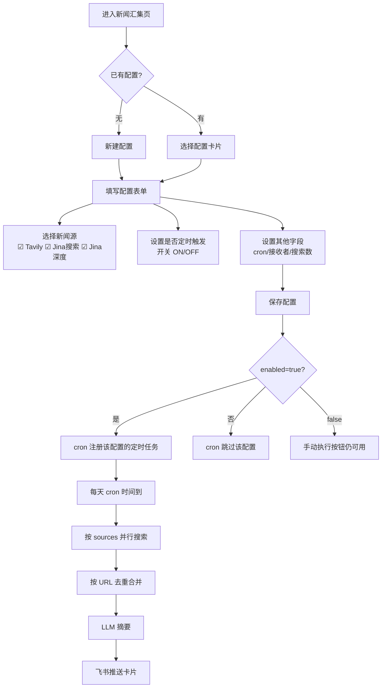

# PRD：新闻汇集多新闻源集成

## 产品定位

为"新闻汇集"模块增加多搜索源并行采集能力和定时推送开关，让每条配置可独立选择新闻来源并控制是否参与定时调度。

## 核心用户旅程

## 功能范围

### 做什么
- 新增 `enabled` 字段：控制 cron 调度，**不影响手动执行**（disabled 时按钮仍可用方便测试）
- 新增 `sources` 字段：多选新闻源，三个选项：
  - `tavily` — Tavily 搜索（现有，API key 独立）
  - `jina_search` — Jina Search API (`s.jina.ai`) 搜索
  - `jina_deep` — Jina Search 搜索 URL → Jina Reader (`r.jina.ai`) 逐篇全文，并发限制 5
- 集成 Jina Search + Jina Reader API，各自独立 API key（`JINA_API_KEY`）
- 工作流改为按 sources 并行搜索 → URL 去重合并 → LLM 摘要
- `/news-cron-status` 端点返回各源 API key 配置状态（`configured`/`missing`）
- 前端配置卡片显示启用/禁用状态，source 未配 key 时显示 ⚠️

### 不做什么
- 不改变飞书卡片格式
- 不改变 LLM 摘要 prompt
- 不改变手动执行的 SSE 流式响应格式
- 不改动 Tavily 现有逻辑
- 不做新闻源的权重/优先级排序

## 非功能需求

- **向后兼容**：旧配置（无 enabled/sources 字段）默认 `enabled=true`, `sources=["tavily"]`
- **sources 空数组兜底**：遇空或缺失时回退 `["tavily"]`，log warning
- **源独立容错**：单个源失败不影响其他源（`Promise.allSettled`）
- **并发控制**：`jina_deep` 的 `readUrl()` 阶段用 `p-limit` 限制 5 并发
- **API Key 隔离**：Tavily (`TAVILY_API_KEY`) 和 Jina (`JINA_API_KEY`) 独立，各自可选配
- **日志可观测**：搜索阶段前缀 `[tavily]` / `[jina_search]` / `[jina_deep]`
