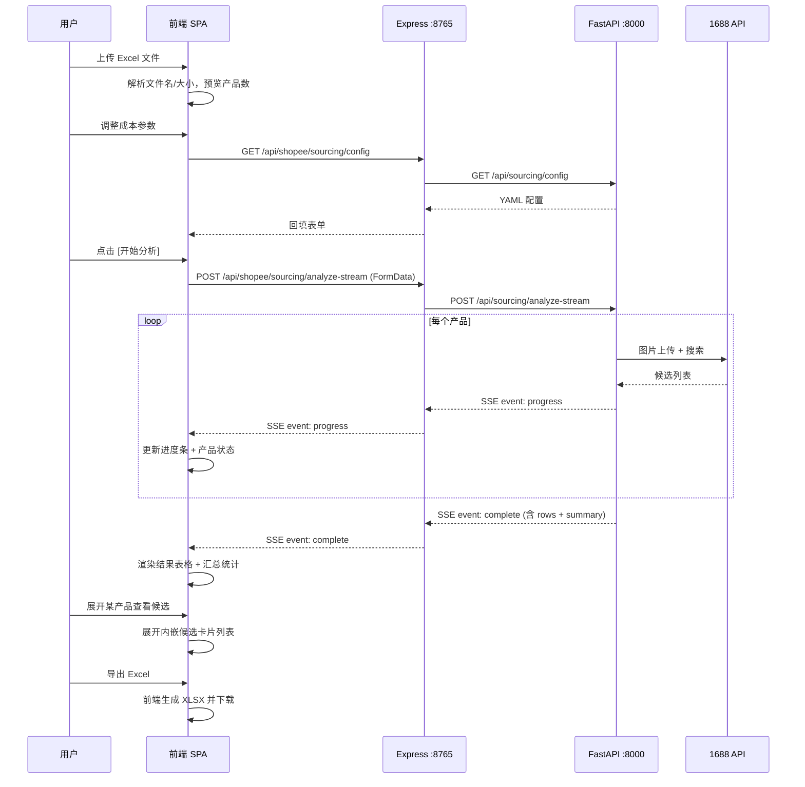

# Phase 2: 用户故事 — 选品比价工具

## 页面整体布局

```
┌──────────────────────────────────────────────────────────────┐
│  Header (全局导航)                                            │
├──────────────────────────────────────────────────────────────┤
│                                                              │
│  ┌─ ① 上传区域 ──────────────────────────────────────────┐  │
│  │  Dropzone: 拖拽或点击上传 Shopee Excel                  │  │
│  │  已上传: filename.xlsx · 20个产品 · 3.2MB               │  │
│  └──────────────────────────────────────────────────────┘  │
│                                                              │
│  ┌─ ② 成本配置 ─────────────────────────────────────────┐  │
│  │  汇率 [1.70]  运费R$ [5.00]  清关费R$ [2.00]  杂费   │  │
│  │  R$ [1.00]                                             │  │
│  │  推荐阈值 [30%]  可考虑阈值 [15%]                       │  │
│  │  [💾 保存配置]  [↺ 加载已保存]  [↶ 恢复默认]           │  │
│  └──────────────────────────────────────────────────────┘  │
│                                                              │
│  [🚀 开始分析]  ← 主按钮                                     │
│                                                              │
│  ┌─ ③ SSE 进度 (分析中才显示) ─────────────────────────┐  │
│  │  ████████████░░░░░░░░  6/20 搜图中                     │  │
│  │  产品A ✓3候选 · 产品B ✓5候选 · 产品C ⏳搜索中          │  │
│  └──────────────────────────────────────────────────────┘  │
│                                                              │
│  ┌─ ④ 结果汇总表 ─────────────────────────────────────┐  │
│  │  产品 │Shopee售价│1688价│落地成本│利润│利润率│推荐    │  │
│  │  ────┼─────────┼──────┼───────┼───┼─────┼───────    │  │
│  │  A    │R$ 19.90│¥7.40 │R$9.35│R$6│30.2%│🟢推荐     │  │
│  │  B    │R$ 29.90│¥10.50│R$12.8│R$5│16.7%│🟡可考虑   │  │
│  │  [每行可展开 ↓ 查看候选商品列表]                        │  │
│  │  [📥 导出 Excel]                                        │  │
│  └──────────────────────────────────────────────────────┘  │
│                                                              │
└──────────────────────────────────────────────────────────────┘
```

## 交互流程图



---

## Epic 1: 数据导入

### US-1 | 上传多个 Shopee Excel 并预览

**As a** 运营人员
**I want** 上传多个 Shopee 店铺导出的 Excel 文件并看到合并解析结果
**So that** 我能一次分析多个店铺的数据，不用分批操作

**验收标准：**
- [ ] 拖拽多个 .xlsx/.xls 文件到 Dropzone，或点击多选文件
- [ ] 上传后显示文件列表：每个文件的名称、大小、行数
- [ ] 文件列表中的文件名自动作为"数据来源"标签
- [ ] 可移除单个文件，移除后文件列表更新
- [ ] 总产品数 = 所有文件行数之和，>0 时才启用 [开始分析] 按钮
- [ ] 任一文件非 Excel 或总大小超 10MB 时显示错误提示
- [ ] 列名不匹配时显示明确的错误消息（指出哪个文件有问题）
- [ ] 更换/增减文件时清空旧的分析结果

---

## Epic 2: 1688 以图搜货

### US-2 | 实时观测搜货进度

**As a** 运营人员
**I want** 看到每个产品 1688 搜货的实时进度
**So that** 我知道分析进展到哪了、有没有产品搜不到

**验收标准：**
- [ ] 点击 [开始分析] 后显示进度区域
- [ ] 总体的进度条实时更新 (N/M)
- [ ] 每个产品显示实时状态：⏳等待中 → 🔍搜索中 → ✓N候选 → ✗失败
- [ ] 搜到候选的产品显示候选数量，点击可展开看详情
- [ ] 搜不到的产品显示失败原因（no image_url / 网络错误等）
- [ ] 所有产品搜索完成后自动进入成本计算阶段

### US-3 | 查看候选商品详情

**As a** 运营人员
**I want** 查看每个产品的 1688 候选商品信息
**So that** 我能判断哪个供应商最合适

**验收标准：**
- [ ] 搜索结果中每个产品可展开，显示候选商品卡片列表
- [ ] 候选卡片显示：标题、价格 ¥、销量、店铺名、起批量、标签（高度同款等）
- [ ] 点击候选商品链接可跳转 1688 详情页（新标签页打开）
- [ ] 最佳候选（第一个）的价格高亮显示在汇总表中

---

## Epic 3: 成本利润计算

### US-4 | 配置成本参数

**As a** 运营人员
**I want** 输入成本参数（汇率、运费、清关费、杂费）
**So that** 系统能准确计算每个产品的落地成本和利润

**验收标准：**
- [ ] 表单显示 4 个成本输入框 + 2 个阈值输入框，带默认值
- [ ] 每个输入框有清晰的标签和单位（R$ / %）
- [ ] 输入非法值（负数/字母）时显示校验错误
- [ ] 修改参数后 [开始分析] 使用最新值计算

### US-5 | 查看利润分析结果

**As a** 运营人员
**I want** 在结果表中看到每个产品的成本、利润、利润率
**So that** 我能快速判断哪些产品值得采购

**验收标准：**
- [ ] 结果表列：产品名 | Shopee售价 | 1688最低价 | 落地成本 | 利润 | 利润率 | 推荐
- [ ] 利润率显示为百分比格式（如 30.2%）
- [ ] 推荐列显示四色标签：🟢推荐 / 🟡可考虑 / 🔴预警 / ⚪待补全
- [ ] 无 1688 数据的产品显示"待补全"，成本和利润留空
- [ ] 价格显示原始格式（R$ 19,90 / ¥ 7.40），保留货币符号

### US-6 | 查看汇总统计

**As a** 运营人员
**I want** 看到分析结果的汇总统计
**So that** 我能一眼了解整体选品情况

**验收标准：**
- [ ] 汇总区显示：总产品数 / 有1688数据 / 推荐 / 可考虑 / 预警 / 待补全 各数量
- [ ] 数字用醒目样式（如彩色标签 Badge）
- [ ] 分析完成后汇总区随结果表一同出现

---

## Epic 4: 配置管理

### US-7 | 保存和加载成本配置

**As a** 运营人员
**I want** 保存我的成本参数到服务器，下次打开自动加载
**So that** 我不需要每次都重新输入汇率和运费

**验收标准：**
- [ ] 页面打开时自动 GET /api/shopee/sourcing/config 加载已保存配置
- [ ] 表单回填服务器返回的默认值
- [ ] 点击 [保存配置] → PUT /api/shopee/sourcing/config 持久化
- [ ] 保存成功后显示 toast 提示（sonner）
- [ ] [恢复默认] 按钮将表单重置为系统默认值（不调服务器）
- [ ] 配置加载失败时使用前端硬编码的 fallback 默认值

---

## Epic 5: 结果导出与工具入口

### US-8 | 导出分析结果到 Excel

**As a** 运营人员
**I want** 将分析结果导出为 Excel 文件下载
**So that** 我能离线查看或分享给团队

**验收标准：**
- [ ] 结果表上方显示 [导出 Excel] 按钮
- [ ] 仅在分析完成（有结果数据）时按钮可用
- [ ] 点击下载 .xlsx 文件，包含两个 sheet：汇总决策表 + 候选明细表
- [ ] 前端使用 SheetJS (xlsx) 库生成下载

### US-9 | 工具入口注册

**As a** 公司同事
**I want** 在工具库中看到选品比价工具入口
**So that** 我能发现和使用这个新工具

**验收标准：**
- [ ] `src/data/software.ts` 添加选品比价工具条目
- [ ] `src/App.tsx` 添加路由 `/sourcing-tool`
- [ ] 工具卡片显示名称、描述、图标（lucide Scale 图标）
- [ ] 卡片点击跳转到 `/sourcing-tool`
- [ ] 分类为 "Web 工具"
