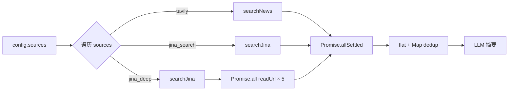

# 用户故事：新闻汇集多新闻源集成

## US-1 | 数据模型 & 校验

| 项 | 内容 |
|---|------|
| **As a** | 开发者 |
| **I want** | `NewsConfig` 类型和 zod schema 包含 `enabled` 和 `sources` 字段 |
| **So that** | 前后端对配置结构有统一约束，旧数据向后兼容 |

- `NewsConfig` 新增 `enabled: boolean`（默认 `true`）
- `NewsConfig` 新增 `sources: ("tavily" | "jina_search" | "jina_deep")[]`（默认 `["tavily"]`）
- `defaults` 对象同步包含
- `newsConfigSchema` zod 校验：`sources.min(1)`，`enabled` 默认 true

---

## US-2 | Jina API 集成

| 项 | 内容 |
|---|------|
| **As a** | 后端服务 |
| **I want** | `lib/jina.ts` 封装 Jina Search 和 Reader API |
| **So that** | 搜索工作流可以调用 Jina 作为新闻源 |

- `searchJina(query, options)` — GET `s.jina.ai?q=query`
- `readUrl(url)` — GET `r.jina.ai/<url>` + `Accept: application/json`
- API key 从 `process.env.JINA_API_KEY` 读取
- 错误返回空数组，不抛异常

---

## US-3 | 多源并行搜索工作流

| 项 | 内容 |
|---|------|
| **As a** | 新闻汇集用户 |
| **I want** | 选择多个新闻源后，搜索阶段并行采集、去重合并 |
| **So that** | 获得更全面、多角度的新闻覆盖 |



- `searchBySource()` 调度
- `Promise.allSettled` 容错
- URL 去重
- `jina_deep` 的 `readUrl` 用 `p-limit(5)` 并发控制
- SSE 前缀 `[tavily]` / `[jina_search]` / `[jina_deep]`

---

## US-4 | Cron 调度器识别 enabled

| 项 | 内容 |
|---|------|
| **As a** | 配置管理员 |
| **I want** | `enabled=false` 的配置不参与 cron 定时调度 |
| **So that** | 可以保留配置草稿，只在需要时才自动推送 |

- `rebuildCronJobs()` 跳过 `config.enabled === false`
- `/news-cron-status` 不包含已禁用配置

---

## US-5 | 环境变量 & 部署配置

| 项 | 内容 |
|---|------|
| **As a** | 运维者 |
| **I want** | Jina API key 通过环境变量注入，本地和服务器一致 |

- `.env` 新增 `JINA_API_KEY`
- systemd service 新增 `Environment=JINA_API_KEY=...`

---

## US-6 | 前端配置表单：enabled 开关 + sources 多选

```
┌─ ConfigPanel ──────────────────────────┐
│  模式:  [AI 生成]  [手动配置]           │
│  目标描述:  ┌──────────────────────┐   │
│             │ textarea             │   │
│             └──────────────────────┘   │
│  定时触发:   [======== ON ========] ◉   │
│  新闻源:                                │
│  ☑ Tavily                              │
│  ☑ Jina 搜索                           │
│  ☐ Jina 深度  ⚠️ API Key 未配置        │
│  每天定时:   [08:00]                    │
│  [保存配置]                              │
└─────────────────────────────────────────┘
```

---

## US-7 | 前端配置卡片：enabled 状态指示

```
┌─ 配置列表 ─────────────┐
│ ┌─────────────────────┐ │
│ │ 🟢 新闻素材  [编辑][删]│ │
│ │ Tavily · Jina搜索    │ │
│ └─────────────────────┘ │
│ ┌─────────────────────┐ │
│ │ ⚫ A股打新   [编辑][删]│ │
│ │ Tavily              │ │
│ └─────────────────────┘ │
│ [+ 新建配置]             │
└─────────────────────────┘
```

---

## US-8 | /news-cron-status 返回 API Key 状态

| 项 | 内容 |
|---|------|
| **As a** | 前端 / 运维 |
| **I want** | cron-status 端点告诉我各源 API key 是否已配置 |

- 新增 `api_keys: { tavily: "configured"|"missing", jina: "configured"|"missing" }`

---

## US-9 | 清除旧数据 + 全链路 API 测试

| 项 | 内容 |
|---|------|
| **As a** | 开发者 |
| **I want** | 清空 DB 旧数据，curl 验证全部功能 |

- 清空 `agent.news_configs`
- POST/PUT 测试 `enabled` + `sources` 字段
- SSE 执行日志验证并行搜索
- `healthy` + `api_keys` 完整性检查

---

## US-10 | 前端流水线多源搜索进度

```
┌─ PipelineView ─────────────────────┐
│  ✅ 启动                           │
│  ✅ 生成主题                        │
│  🔍 搜索新闻                        │
│    ├─ ✅  Tavily (12条)             │
│    ├─ 🔍  Jina搜索 搜索中...        │
│    └─ ⏳  Jina深度 等待中           │
│  ⏳ 摘要                           │
│  ⏳ 组装卡片                        │
│  ⏳ 发送飞书                        │
└────────────────────────────────────┘
```

- N 个子行对应 N 个 source
- 状态：🔍 搜索中 / ✅ 完成 / ❌ 失败
- 全部完成后进入摘要阶段
